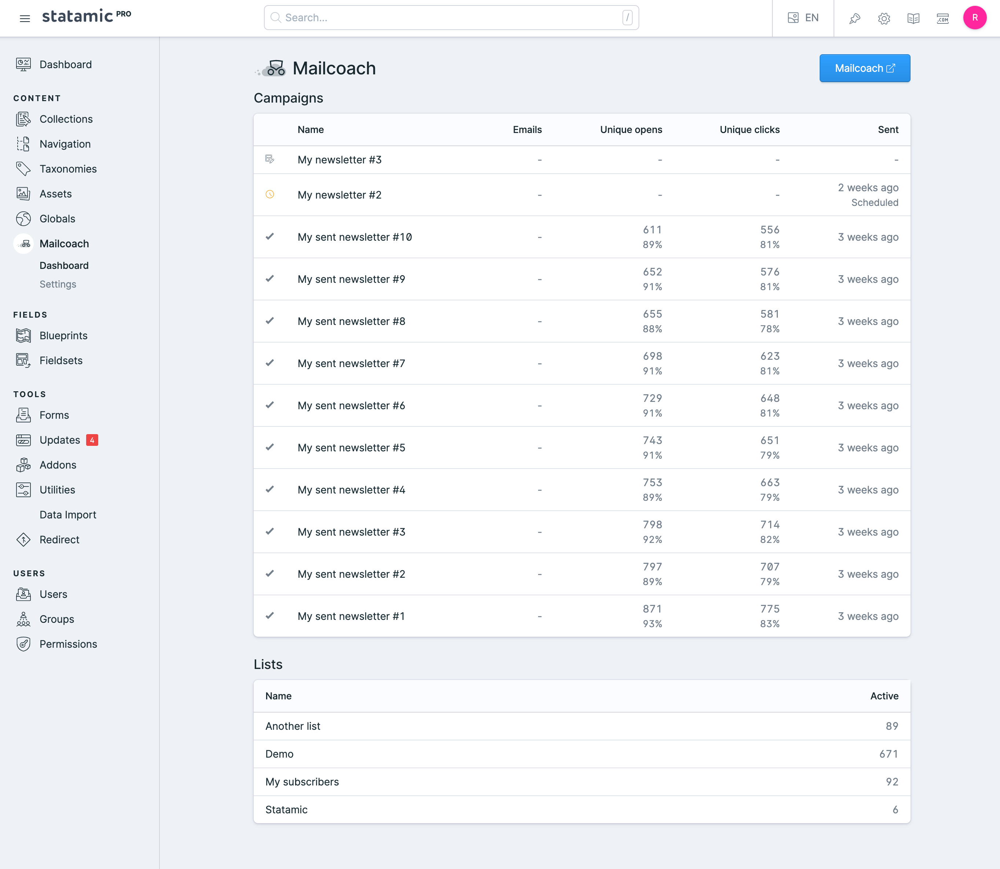

[](https://supportukrainenow.org)

[](https://github.com/spatie/statamic-mailcoach/releases)

# Mailcoach

> Mailcoach for Statamic 3.

This addon shows a summary of your Mailcoach campaigns, lists and templates inside the Statamic control panel.



## Support us

We invest a lot of resources into creating [best in class open source packages](https://spatie.be/open-source). You can support us by [buying one of our paid products](https://spatie.be/open-source/support-us). 

We highly appreciate you sending us a postcard from your hometown, mentioning which of our package(s) you are using. You'll find our address on [our contact page](https://spatie.be/about-us). We publish all received postcards on [our virtual postcard wall](https://spatie.be/open-source/postcards).

## Installation

Require it using Composer.

```
composer require spatie/statamic-mailcoach
```

### Changelog

Please see [CHANGELOG](CHANGELOG.md) for more information what has changed recently.

## Contributing

Please see [CONTRIBUTING](https://github.com/spatie/.github/blob/main/CONTRIBUTING.md) for details.

## Security

If you discover any security related issues, please email [security@spatie.be](mailto:security@spatie.be) instead of using the issue tracker.

## Credits

- [Rias Van der Veken](https://github.com/riasvdv)
- [All Contributors](../../contributors)

## License

The MIT License (MIT). Please see [License File](LICENSE.md) for more information.

